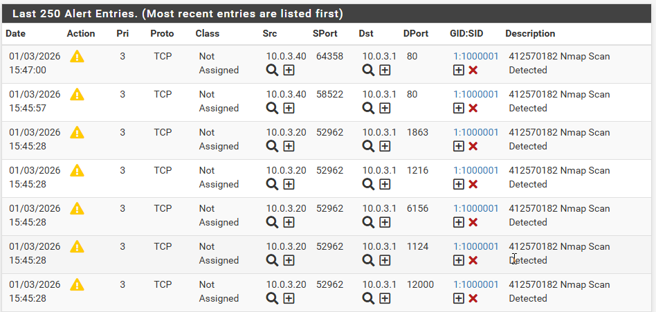
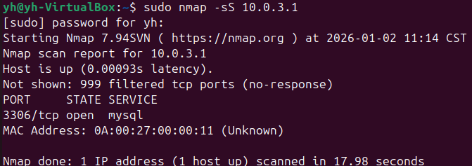
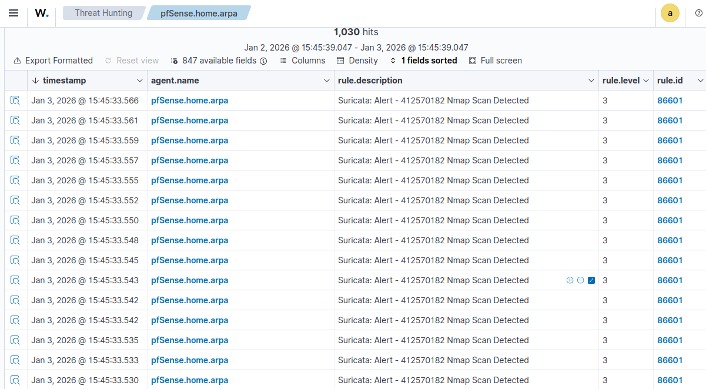

# 威脅情資分析與數據導向威脅獵捕實務期末作業-Wazuh與pfSense偵測關聯與回應

**系級：** 醫資三  
**學號：** 412570182  
**姓名：** 閻宇虹  

---

## 一、 作業目標
主要目標是透過Wazuh Agent將pfSense防火牆的Suricata偵測日誌傳送到Wazuh Manager，進行安全事件的關聯分析。透過模擬真實的攻擊行為，驗證系統的監控與警報能力。

---

## 二、 實作過程紀錄與技術修正

在實作過程中，遇到了幾個關鍵問題並成功排除，以下是本次作業最重要的學習成果：

### 1. 版本不一修正
由於官方4.13.1版本下載受限，導致Agent無法安裝。將Wazuh Manager與Dashboard同步升級至**v4.14.1**，確保後端與pfSense Agent版本完全相容。

*(圖：確認Agent版本為v4.14.1 且狀態為Active)*

### 2. 通訊協定校正 (TCP)
原本Agent預設使用UDP連線導致連線失敗（Closing connection）。手動修改pfSense的`ossec.conf`，將協定改為**TCP**，成功解決了連線問題。

### 3. 日誌路徑定位
透過find指令精確找出Suricata生成的日誌路徑為 `/var/log/suricata/suricata_em16826/eve.json`，並同步修改Agent設定，確保Wazuh能讀取到正確的警告資料。

---

## 三、 攻擊模擬與偵測驗證

### 1. 撰寫自訂規則 (Custom Rules)
為了辨識特定攻擊，在pfSense中撰寫了一條帶有學號的自訂規則：
`alert tcp any any -> $HOME_NET any (msg:"412570182 Nmap Scan Detected"; flags:S; sid:1000001; rev:1;)`

*(圖：自訂規則 msg:"412570182 Nmap Scan Detected")*

### 2. 發動攻擊行為
使用Ubuntu Server對pfSense執行**Nmap SYN 掃描**。

*(圖：執行sudo nmap -sS 10.0.3.1進行掃描)*

### 3. 實驗成果證明

* **pfSense 端**：Suricata Alerts 成功抓到掃描行為。

*(圖：pfSense介面顯示412570182警告訊息)*

* **Wazuh 端**：Dashboard 成功接收到告警訊息，證明資料傳送管線完全暢通。

*(圖：Wazuh Dashboard接收到含有學號之警告事件)*

---

## 四、 風險分析與回應建議

### 1. 事件風險分析
此告警代表攻擊者正在進行「偵查階段」的埠口掃描。這在真實環境中代表駭客正試圖尋找開放的服務漏洞。若不及時發現，接下來可能就是針對性的滲透攻擊。

### 2. 回應與阻擋建議
目前系統已完成「偵測」與「傳送」。若要達成「回應（阻擋）」，可以在pfSense的Suricata設定中啟用**"Block Offenders"**功能。一旦偵測到此類Nmap掃描，防火牆會自動封鎖來源IP，實現即時的主動防禦。

---

## 五、 真實環境風險評估

根據本次實驗偵測到的「Nmap SYN掃描」事件，其在真實生產環境中可能代表以下風險：

1. **偵查行為**：這是攻擊者發動正式入侵前的預兆。駭客透過掃描探測防火牆開放的埠口，藉此蒐集伺服器運行的服務版本與潛在漏洞資訊。
2. **針對性攻擊的前奏**：一旦攻擊者確認了開放服務(如本作業中的80或443埠口），接下來便可能針對該服務發動暴力破解、DDoS 攻擊或利用已知CVE漏洞進行滲透。及早透過Wazuh發現此類掃描，能讓資安人員在損害發生前先行封鎖惡意IP。
